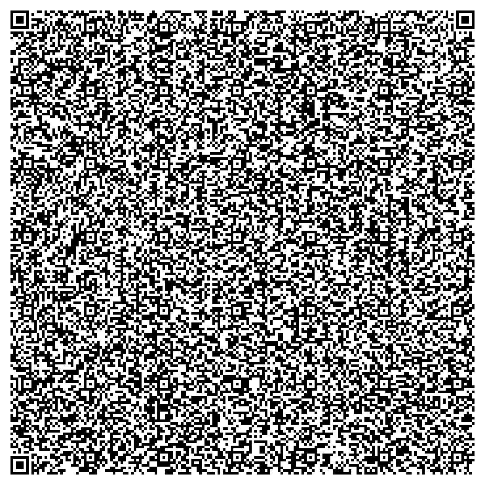

# QR Maze - A game that fits within a QR code

https://github.com/user-attachments/assets/70fd6988-64ab-4145-b77c-fed2baaea413

---

QR Maze is a fun little project I developed, designed to fit within the size constraints of a QR code. It features a maze with various difficulty levels and a timer to track the time spent solving it.

## Demo

Scan this QR code:



or paste this into your browser:
```
data:text/html;base64,CjxzdHlsZT4jY29udHJvbHMsI3UsYm9keSxjYW52YXN7bWFyZ2luOjEwcHg7dGV4dC1hbGlnbjpjZW50ZXI7Zm9udC1mYW1pbHk6QXJpYWx9Y2FudmFze2JvcmRlcjpzb2xpZH08L3N0eWxlPjxoMT5NYXplPC9oMT48cD5QcmVzcyBhbmQgaG9sZCB0aGUgV0FTRCBrZXlzIHRvIG5hdmlnYXRlIHRocm91Z2ggdGhlIG1hemUhPC9wPjxkaXYgaWQ9ImNvbnRyb2xzIj48bGFiZWwgZm9yPSJkIj5EaWZmaWN1bHR5OjwvbGFiZWw+IDxzZWxlY3QgaWQ9ImQiPjxvcHRpb24gdmFsdWU9ImUiPkVhc3k8L29wdGlvbj48b3B0aW9uIHZhbHVlPSJtIiBzZWxlY3RlZD0ic2VsZWN0ZWQiPk1lZGl1bTwvb3B0aW9uPjxvcHRpb24gdmFsdWU9ImgiPkhhcmQ8L29wdGlvbj48b3B0aW9uIHZhbHVlPSJpIj5JbXBvc3NpYmxlPC9vcHRpb24+PC9zZWxlY3Q+PC9kaXY+PGNhbnZhcyBpZD0ibSI+PC9jYW52YXM+PGRpdiBpZD0idSI+UmVhY2ggdGhlIGdyZWVuIHNxdWFyZSE8L2Rpdj48ZGl2IGlkPSJwIj5UaW1lIExlZnQ6IDxzcGFuIGlkPSJiIj48L3NwYW4+IHNlY29uZHM8L2Rpdj48ZGl2IGlkPSJqIj5Ub3RhbCBTY29yZTogPHNwYW4gaWQ9ImsiPjA8L3NwYW4+PC9kaXY+PHNjcmlwdD52YXIgcyxiLHJvd3MsbSx3LG4scCxqLGcsdix6PShpZD1lPT5kb2N1bWVudC5nZXRFbGVtZW50QnlJZChlKSkoIm0iKSxlPXouZ2V0Q29udGV4dCgiMmQiKSxkPWlkKCJkIiksYT1pZCgiYiIpLGM9aWQoImsiKSxrPVtbMCwtMV0sWzAsMV0sWy0xLDBdLFsxLDBdXTtmdW5jdGlvbiBoKCl7ei53aWR0aD16LmhlaWdodD1yb3dzKnMsZS5jbGVhclJlY3QoMCwwLHoud2lkdGgsei5oZWlnaHQpLG0ubWFwKCh0LHIpPT50Lm1hcCgodCxuKT0+e2UuZmlsbFN0eWxlPXQ/ImJsYWNrIjoid2hpdGUiLGUuZmlsbFJlY3QobipzLHIqcyxzLHMpfSkpLGUuZmlsbFN0eWxlPSJyZWQiLGUuZmlsbFJlY3Qody54KnMsdy55KnMscyxzKSxlLmZpbGxTdHlsZT0iZ3JlZW4iLGUuZmlsbFJlY3Qobi54KnMsbi55KnMscyxzKX1mdW5jdGlvbiBtcChlKXtsZXQgdD13Lngscj13Lnk7InciPT09ZT9yLS06InMiPT09ZT9yKys6ImEiPT09ZT90LS06ImQiPT09ZSYmdCsrLDA8PXQmJjA8PXImJnQ8cm93cyYmcjxyb3dzJiYwPT09bVtyXVt0XSYmKHcueD10LHcueT1yLGgoKSx3Lng9PT1uLngpJiZ3Lnk9PT1uLnkmJihjbGVhckludGVydmFsKHApLGNsZWFySW50ZXJ2YWwoZyksZG9jdW1lbnQuZ2V0RWxlbWVudEJ5SWQoInUiKS50ZXh0Q29udGVudD0iWW91IHJlYWNoZWQgdGhlIGdvYWwhIDp5YXk6IixqKz1iLGMudGV4dENvbnRlbnQ9ail9ZnVuY3Rpb24gaW5pdCgpe2NsZWFySW50ZXJ2YWwocCksY2xlYXJJbnRlcnZhbChnKTt2YXIgZT1kLnZhbHVlO3M9ImUiPT09ZT81NToibSI9PT1lPzI5OiJoIj09PWU/MTU6MTAsYj0iZSI9PT1lPzEwOiJtIj09PWU/MzA6ImgiPT09ZT82MDoxMjAsdz17eDowLHk6MH0sbj17eDoocm93cz0iZSI9PT1lPzExOiJtIj09PWU/MjE6ImgiPT09ZT80MTo2MSktMSx5OnJvd3MtMX0saj1qfHwwLG09QXJyYXkocm93cykuZmlsbCgpLm1hcCgoKT0+QXJyYXkocm93cykuZmlsbCgxKSksZnVuY3Rpb24gZSh0LG4pe3ZhciByLGE7bVtuXVt0XT0wO2ZvcihbcixhXW9mIGsuc29ydCgoKT0+TWF0aC5yYW5kb20oKS0uNSkpe3ZhciBsPXQrMipyLG89bisyKmE7MDw9bCYmMDw9byYmbDxyb3dzJiZvPHJvd3MmJjE9PT1tW29dW2xdJiYobVtuK2FdW3Qrcl09MCxlKGwsbykpfX0ody54LHcueSksbVtuLnldW24ueF09MCxoKCksYS50ZXh0Q29udGVudD1iLGRvY3VtZW50LmdldEVsZW1lbnRCeUlkKCJ1IikudGV4dENvbnRlbnQ9IlJlYWNoIHRoZSBncmVlbiBzcXVhcmUhIixwPXNldEludGVydmFsKCgpPT57MDxiPyhiLS0sYS50ZXh0Q29udGVudD1iKTooY2xlYXJJbnRlcnZhbChwKSxkb2N1bWVudC5nZXRFbGVtZW50QnlJZCgidSIpLnRleHRDb250ZW50PSJUaW1lJ3MgdXAhIFRyeSBhZ2Fpbi4iKX0sMWUzKX1kb2N1bWVudC5hZGRFdmVudExpc3RlbmVyKCJrZXlkb3duIixlPT57dnx8KHY9ZS5rZXksZz1zZXRJbnRlcnZhbCgoKT0+bXAodiksNTApKX0pLGRvY3VtZW50LmFkZEV2ZW50TGlzdGVuZXIoImtleXVwIixlPT57ZS5rZXk9PT12JiYoY2xlYXJJbnRlcnZhbChnKSx2PWc9MCl9KSxkLmFkZEV2ZW50TGlzdGVuZXIoImNoYW5nZSIsaW5pdCksaW5pdCgpPC9zY3JpcHQ+
```

## Technologies Used

- HTML
- CSS
- JavaScript
